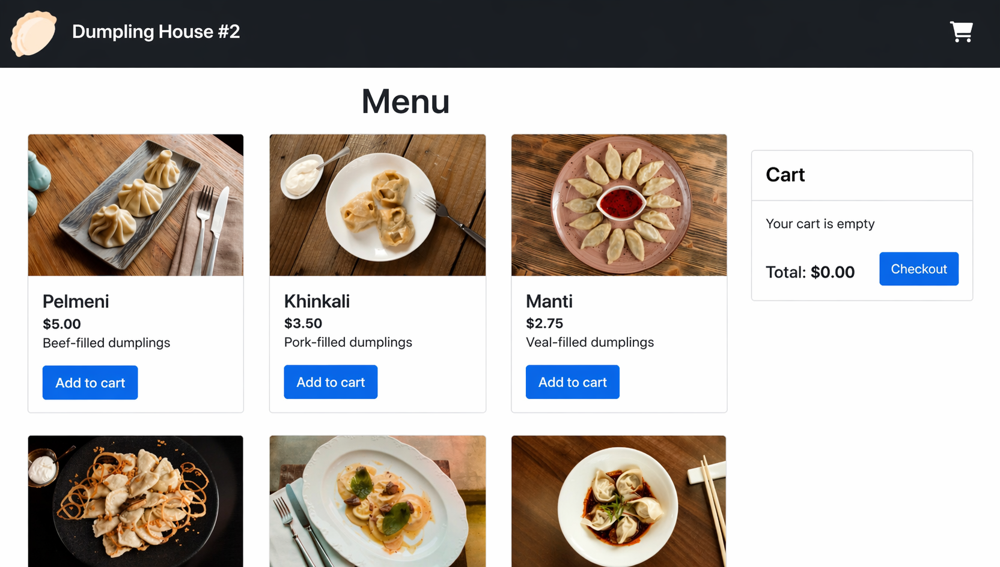

# Momo Store aka Dumpling House No. 2



A full-stack "dumpling shop" demo: Vue 3 SPA (frontend) + Go API (backend).

## Repository layout

```
.
├── backend/            # Go API (port 8081)
│   ├── Dockerfile      # multi-stage, distroless runtime
│   └── Taskfile.yml    # backend tasks
├── frontend/           # Vue 3 SPA (port 8080)
│   ├── Dockerfile      # multi-stage, nginx runtime
│   ├── nginx.conf      # SPA routing + /healthz
│   └── Taskfile.yml    # frontend tasks
├── docker-compose.yml  # local development for both services
└── Taskfile.yml        # root Taskfile, includes back/* and front/*
```

## Requirements

- [Docker](https://docs.docker.com/get-docker/) ≥ 24 with the `docker compose` plugin
- [Task](https://taskfile.dev/installation/) ≥ 3 — `brew install go-task` (macOS) or `go install github.com/go-task/task/v3/cmd/task@latest`

Optionally, for running without Docker:

- Go ≥ 1.26
- Node.js ≥ 20

## Quick start

```bash
task up
```

This builds the backend image, starts a hot-reloading frontend dev server on top of `node:20-alpine`, and exposes:

- Frontend → http://localhost:8080
- Backend → http://localhost:8081 (`/health`, `/metrics`, `/products`, ...)

Stop and remove the stack:

```bash
task down
```

## Available tasks

```bash
task              # list all tasks
task --list-all
```

Most useful ones:

| Task                      | Description                                                                      |
|---------------------------|----------------------------------------------------------------------------------|
| `task up`                 | Bring the full stack up via docker compose                                       |
| `task down`               | Tear it down                                                                     |
| `task logs`               | Tail compose logs for all services (`SERVICE=backend task logs` to limit to one) |
| `task ps`                 | Show service status                                                              |
| `task build`              | Rebuild compose images                                                           |
| `task test`               | Run backend Go tests                                                             |
| `task docker:build`       | Build production images for both services                                        |
| `task back:run`           | Run the backend natively (`go run`)                                              |
| `task back:test`          | Backend tests                                                                    |
| `task back:docker:build`  | Build the backend production image                                               |
| `task back:docker:run`    | Run the backend production image                                                 |
| `task front:serve`        | Vue dev server (native)                                                          |
| `task front:build`        | Build the SPA into `frontend/dist`                                               |
| `task front:docker:build` | Build the frontend production image                                              |
| `task front:docker:run`   | Run the frontend production image                                                |

## Production images

Both Dockerfiles are multi-stage and intended for publishing to a Container Registry.

- **backend**: `golang:1.26-alpine` → `gcr.io/distroless/static-debian12:nonroot`. Statically linked binary (`CGO_ENABLED=0`), runs as a non-root user, listens on `:8081`.
- **frontend**: `node:20-alpine` → `nginxinc/nginx-unprivileged:1.27-alpine`. Static assets from `dist/` are served under the `/momo-store/` path (see [`frontend/vue.config.js`](frontend/vue.config.js)). The API URL is inlined at build time via `--build-arg VUE_APP_API_URL`.

Build with a custom tag and API URL:

```bash
TAG=v0.1.0 task back:docker:build
TAG=v0.1.0 API_URL=https://api.example.com task front:docker:build
```

Run the production images locally:

```bash
task back:docker:run     # http://localhost:8081
task front:docker:run    # http://localhost:8080/momo-store/
```

OCI image labels (`org.opencontainers.image.version`, `revision`, `created`) are populated automatically from `git describe`, `git rev-parse HEAD`, and the current UTC timestamp by the Taskfile. CI pipelines can override them via `--build-arg`.

## CI/CD

GitHub Actions workflows live in [`.github/workflows/`](.github/workflows/):

| Workflow                                       | Trigger                                 | What it does                                          |
|------------------------------------------------|-----------------------------------------|-------------------------------------------------------|
| [`ci.yml`](.github/workflows/ci.yml)           | Pull request to `main`                  | Runs Go tests, builds both Docker images (no push)    |
| [`release.yml`](.github/workflows/release.yml) | Push to `main` and `release-*` branches | Builds and pushes images to Yandex Container Registry |

### Branching model

Modified trunk-based:

- **`main`** — single integration branch; always releasable. Every PR merged here triggers a build that pushes `:main` and `:main-<sha>` images to YCR. ArgoCD picks them up and deploys to **staging**.
- **`release-YYMMDDHHMM`** — short-lived release branches cut from `main` for promoting to production. The trailing `YYMMDDHHMM` is just a UTC timestamp serving as the release version (no SemVer). Push to such a branch triggers a build, **pauses for manual approval** in the `production` GitHub environment, then pushes `:YYMMDDHHMM`, `:release-YYMMDDHHMM`, and `:release-YYMMDDHHMM-<sha>` images. ArgoCD deploys to **production**.
- **Hotfix flow** — fix in `main` → cherry-pick into a fresh `release-YYMMDDHHMM` branch cut from the broken release.

### Image tag scheme

| Trigger                      | Tags pushed                                                        |
|------------------------------|--------------------------------------------------------------------|
| Push to `main`               | `:main`, `:main-<sha7>`                                            |
| Push to `release-2604301700` | `:release-2604301700`, `:release-2604301700-<sha7>`, `:2604301700` |
| Pull request                 | (built only, not pushed)                                           |

The bare timestamp tag (`:2604301700`) is what ArgoCD's production Application Set tracks via a regex like `^\d{10}$`.

### Required GitHub configuration

Once-off setup in the repository:

1. **Repository secrets** (Settings → Secrets and variables → Actions → New repository secret):
   - `YC_SA_JSON_KEY` — full JSON of the Yandex Cloud service account key with the `container-registry.images.pusher` role on the registry.
2. **Repository variables** (same screen, Variables tab):
   - `YC_REGISTRY_ID` — the registry ID (`crp...`).
3. **Environments** (Settings → Environments → New environment):
   - `staging` — no protection rules. Used by `main` builds.
   - `production` — set "Required reviewers" to yourself / team. Used by `release-*` builds; the workflow waits for an approval click before pushing images.

### Cutting a release

```bash
git checkout main && git pull
git checkout -b release-$(date -u +%y%m%d%H%M)
git push -u origin HEAD
```

The push triggers `release.yml`. In the GitHub UI under Actions you'll see the run paused on "Waiting for review" — approve it, and images land in YCR within a couple of minutes.

## Running without Docker

Backend:

```bash
cd backend
go run ./cmd/api
go test -v ./...
```

Frontend:

```bash
cd frontend
npm install
VUE_APP_API_URL=http://localhost:8081 npm run serve
```
